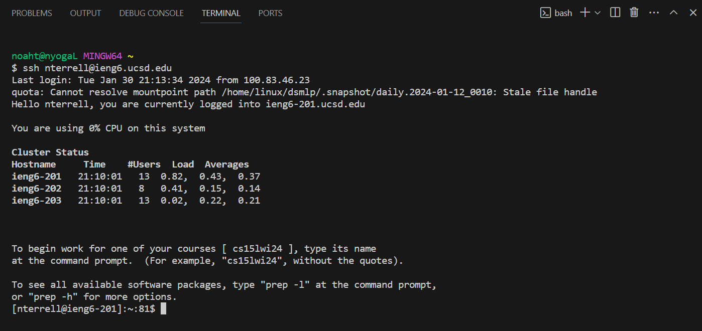

# Lab Report 2
## Part 1
***Code:***
```
import java.io.IOException;
import java.net.URI;

class Handler implements URLHandler {

    String chatServerString = "";
    public String handleRequest(URI url) {

        if (url.getPath().equals("/")) {
            return chatServerString;
        } else if (url.getPath().contains("/add-message")) {
            
            String[] parameter1 = url.getQuery().split("=");
            String[] parameter2 = parameter1[1].split("&");
            String user = parameter1[2];
            String message = parameter2[0];

            if (parameter1[0].equals("s")) {
                chatServerString += user + ": " + message + "\n";
                return chatServerString;   
            } 
            return "404 Not Found!";
        }
        return "404 Not Found!";
    }
}

class ChatServer {
    public static void main(String[] args) throws IOException {
        if(args.length == 0){
            System.out.println("Missing port number! Try any number between 1024 to 49151");
            return;
        }
        int port = Integer.parseInt(args[0]);

        Server.start(port, new Handler());
    }
}
```

***Screenshot 1:***


Methods that are called: ``` .getPath.contains() ```  ``` .split() ```

Explanation:

In screenshot 1 when the "/add-message" path is inside of the url and the rest of the query is corectly added, when the user enters this request into the url then the handelRequest method gets called and the new url gets passed into this method. then inside the handeRequest method, I first check if the url path is equal to "/" or just the default url without any arguments like this. ``` if (url.getPath().equals("/")) ``` Then if it is not equal I check if the url's path contains the "/add-message" path by using the .contains method like this ```else if (url.getPath().contains("/add-message")) ```  And if it does then proceed to split the query by the "=" and "&" symbol by using the ```.split()``` method. 

Relevant arguments to those methods:

For the first screenshot the arguments for the methods used are "/add message" for the .contains() method which would look like this ``` url.getPath.contains("/add-message")``` I also used the "=" and "&" symbols for the arguments for the .split() method which would look like this ``` String[] parameter1 = url.getQuery().split("="); ``` and ``` String[] parameter2 = parameter1[1].split("&");```

Values of relevant fields and what they change to from the specific request in the screenshot: 

The field I use for my class handler is an empty String called chatServerString that looks like this ```String chatServerString = "";``` This field value gets changed when a new request is sent. What happens is that when the request is sent and processed in the handleRequest method, I use the split method to split the query into two variables which are the user name and user message. I then concatenate the user message and user name to the chatServerString field and then return it to the webserver. For the example in the screenshot if the user enters the path "/add-message" and query arguments correctly like this /add-message?s=hi&user=Noah then I split the query into the user name and user message which would be in this case "Noah" and the message "hi". after that I add these two strings to the chatServerString field like this ```chatServerString += user + ": " + message + "\n";``` and then finally I would return this field to the webserver which would look like this "Noah: hi".

***ScreenShot 2:***


Methods that are called: ``` .getPath.contains() ```  ``` .split() ```

Explanation: For the second screenshot the methods that are used are the same ones in the first and have the same explanation as screenshot 1.

Values of relevant fields and what they change to from the specific request in the screenshot: 

For screenshot 2 it uses the same field as screenshot 1 and has the same functionality of how it changes but for this one when the user enters the query parameters for the message "hi how are you" and the user name "Bob" like this /add-message?s=hi how are you&user=Bob then the field gets concatenated like this again ```chatServerString += user + ": " + message + "\n";``` which would return "Bob: hi how are you" to the webserver. 

## Part 2 
***-Absolute path to the private key for my SSH key for logging into ieng6 on my computer:***


***-Absolute path to the public key for my SSH key for logging into ieng6:***


***-Terminal interaction where I log into my ieng6 account without being asked for a password:***


## Part 3

***What I learned from lab in week 2 or 3 that you didn't know before:***

Something I learned in from lab in week 2 or 3 that I didnt know before was how to setup a mini webserver that allows me to enter arguments into the query which would then be able to be displayed on the screen. I thought this was really cool as I was able to update the webserver in real time on two different devices. I also didn't know how to use ssh to login remotely and download files to the ieng6. I thought this was cool because as I am getting more familiar with how to navigate through the terminal, I can start to think about different things that can possibly be done through the terminal remotely. 

