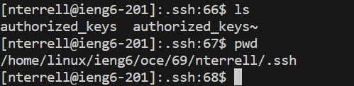

# Lab Report 2
## Part 1
***Code:***
```
import java.io.IOException;
import java.net.URI;

class Handler implements URLHandler {

    String chatServerString = "";
    public String handleRequest(URI url) {

        if (url.getPath().equals("/")) {
            return chatServerString;
        } else if (url.getPath().contains("/add-message")) {
            
            String[] parameter1 = url.getQuery().split("=");
            String[] parameter2 = parameter1[1].split("&");
            String user = parameter1[2];
            String message = parameter2[0];

            if (parameter1[0].equals("s")) {
                chatServerString += user + ": " + message + "\n";
                return chatServerString;   
            } 
            return "404 Not Found!";
        }
        return "404 Not Found!";
    }
}

class ChatServer {
    public static void main(String[] args) throws IOException {
        if(args.length == 0){
            System.out.println("Missing port number! Try any number between 1024 to 49151");
            return;
        }
        int port = Integer.parseInt(args[0]);

        Server.start(port, new Handler());
    }
}
```

***Screenshot 1:***


***ScreenShot 2:***


## Part 2 
***-Absolute path to the private key for my SSH key for logging into ieng6 on my computer:***


***-Absolute path to the public key for my SSH key for logging into ieng6:***


***-Terminal interaction where I log into my ieng6 account without being asked for a password:***

---
## Part 3
