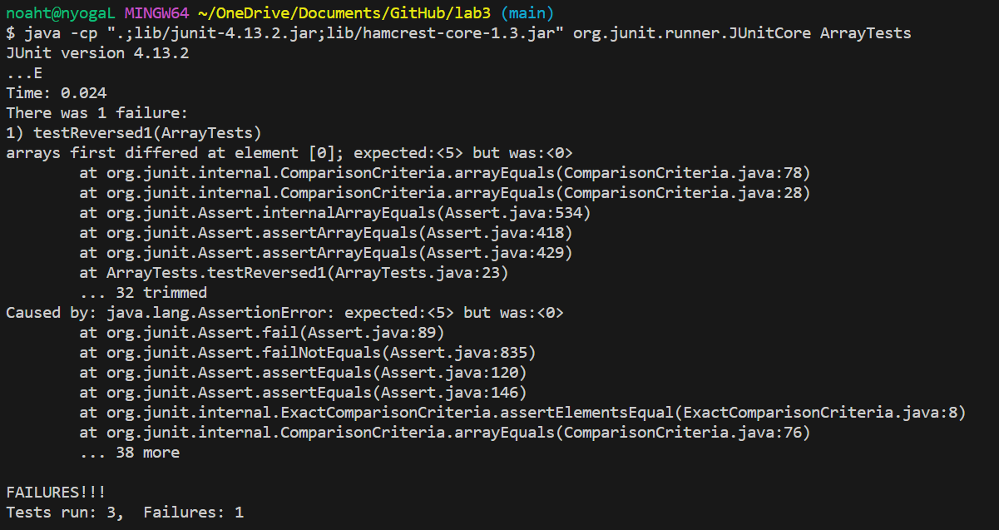
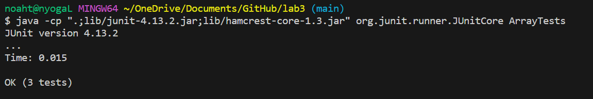

# Lab Report 3
## Part 1 Bugs

***Failure-inducing input for the buggy program as a JUnit Test:***
The input that caused the failure was an array of ```{1,2,3,4} ```.
```
@Test
public void testReversed() {
    int[] input1 = new int[]{1,2,3,4,5};
    assertArrayEquals(new int[]{4,3,2,1},ArrayExamples.reversed(input1));
}
```

***Input that doesn't induce a failure as a JUnit test:***
The input that didnt cause a failure was an input of an empty array ```{} ```.
```
  @Test
  public void testReversed() {
    int[] input1 = { };
    assertArrayEquals(new int[]{ }, ArrayExamples.reversed(input1));
  }
```

***Symptom (output) of the Failure-inducing input for the buggy program as a JUnit Test:***
The symptom of the failure inducing input was that at element 0 the value was 0 but was expected to be 5.




***Symptom (output) of the Input that doesn't induce a failure as a JUnit test:***
The symptom of the input that doesn't induce a failure is that all tests passed. 



***Bug before code:***

```
static int[] reversed(int[] arr) {
    int[] newArray = new int[arr.length];
    for(int i = 0; i < arr.length; i += 1) {
      arr[i] = newArray[arr.length - i - 1];
    }
    return arr;
  }
```

***Bug after code:***

```
static int[] reversed(int[] arr) {
    int[] newArray = new int[arr.length];
    for(int i = 0; i < arr.length; i += 1) {
      newArray[i] = arr[arr.length - i - 1];
    }
    return newArray;
}
```


