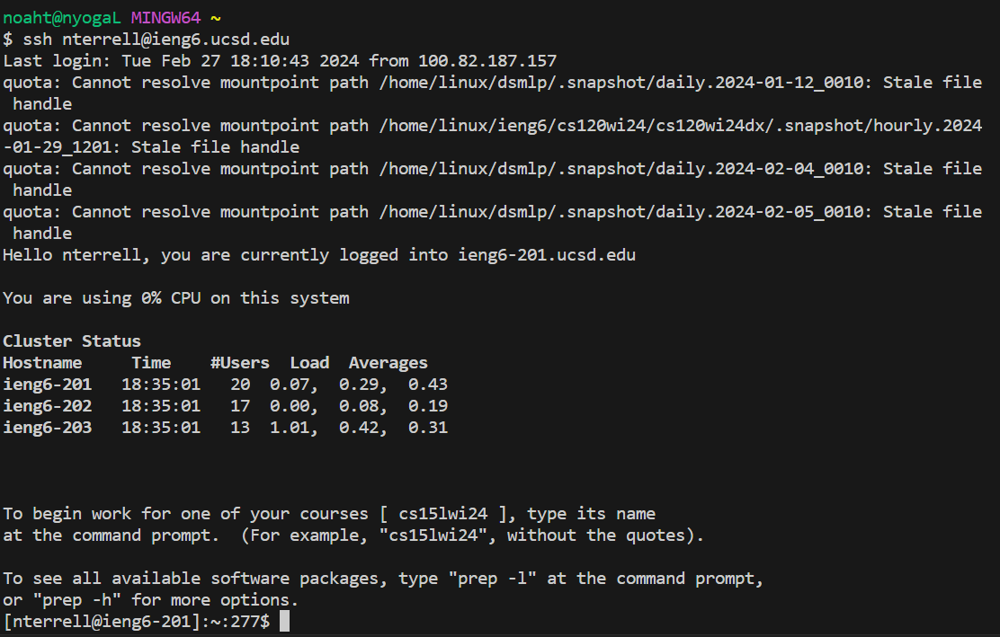
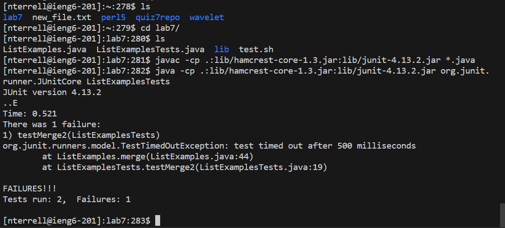

# Lab Report 3
## Vim Task
### Step 4 Log into ieng6:


```
Keys Pressed: <up> <Enter>
```
I logged into ieng6 on my account by pressing the up arrow key and then the Enter key because the command was already in my terminal history.

### Step 5 Clone your fork of the repository from your Github account (using the SSH URL):


```
Keys Pressed: git <Spacebar> clone <Spacebar> Ctrl+V <Enter>
```
I cloned the forked repository of lab7 inside the ieng6 by pasting the ssh URL (git@github.com:NoahTerrellUCSD/lab7.git)

### Step 6 Run the tests, demonstrating that they fail:


```
Keys Pressed:
cd <Spacebar> l <Tab> <Enter>
ls <Enter>
Ctrl+v <Enter>
Ctrl+v <Spacebar> ListExamplesTests <Enter>
```
In the first line I changed the directory to be the lab7 directory using the cd command.<br/>
Then I used the ls command to see what files are in the directory.<br/>
Then I coppied the command to compile the java files and pasted it into the command line using Ctrl+v (javac -cp .:lib/hamcrest-core-1.3.jar:lib/junit-4.13.2.jar *.java)<br/>
Then I coppied the command to run the tests and pasted it into the command line using Ctrl+v (java -cp .:lib/hamcrest-core-1.3.jar:lib/junit-4.13.2.jar org.junit.runner.JUnitCore) then I added the file name. <br/>(ListExamplesTests) of the file with the tests to the end of the command and then pressed enter to run it. 

### Step 7 Edit the code file to fix the failing test:


```
Keys Pressed:
>
```
In the first line I changed the directory to be the lab7 directory using the cd command. <br/>
Then I used the ls command to see what files are in the directory.<br/>
Then I coppied the command to compile the java files and pasted it into the command line using Ctrl+v (javac -cp .:lib/hamcrest-core-1.3.jar:lib/junit-4.13.2.jar *.java)
Then I coppied the command to run the tests and pasted it into the command line using Ctrl+v (java -cp .:lib/hamcrest-core-1.3.jar:lib/junit-4.13.2.jar org.junit.runner.JUnitCore) then I added the file name (ListExamplesTests) of the file with the tests to the end of the command and then pressed enter to run it. 


