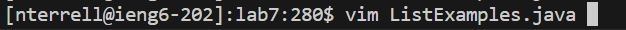
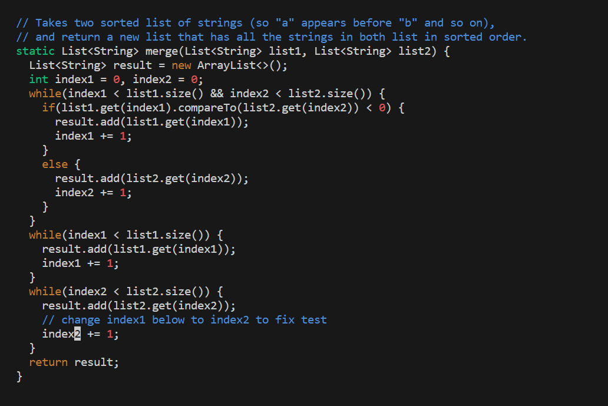
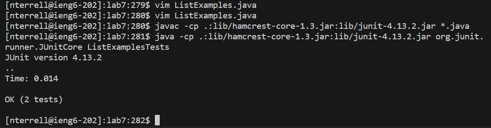
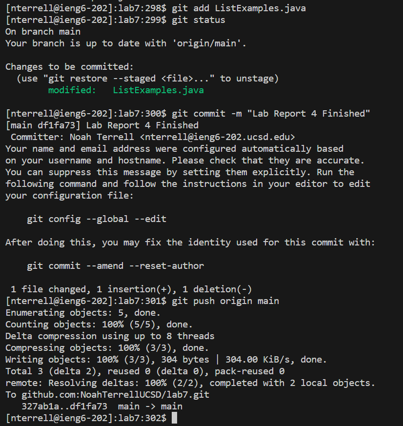

# Lab Report 3
## Vim Task
### Step 4 Log into ieng6:


```
Keys Pressed: <up> <Enter>
```
I logged into ieng6 on my account by pressing the up arrow key and then the Enter key because the command was already in my terminal history.

### Step 5 Clone your fork of the repository from your Github account (using the SSH URL):


```
Keys Pressed: git <Spacebar> clone <Spacebar> Ctrl+V <Enter>
```
I cloned the forked repository of lab7 inside the ieng6 by pasting the ssh URL (git@github.com:NoahTerrellUCSD/lab7.git)

### Step 6 Run the tests, demonstrating that they fail:


```
Keys Pressed:
cd <Spacebar> l <Tab> <Enter>
ls <Enter>
Ctrl+v <Enter>
Ctrl+v <Spacebar> ListExamplesTests <Enter>
```
In the first line I changed the directory to be the lab7 directory using the cd command.<br/>
Then I used the ls command to see what files are in the directory.<br/>
Then I coppied the command to compile the java files and pasted it into the command line using Ctrl+v (javac -cp .:lib/hamcrest-core-1.3.jar:lib/junit-4.13.2.jar *.java)<br/>
Then I coppied the command to run the tests and pasted it into the command line using Ctrl+v (java -cp .:lib/hamcrest-core-1.3.jar:lib/junit-4.13.2.jar org.junit.runner.JUnitCore) then I added the file name (ListExamplesTests) of the file with the tests to the end of the command and then pressed enter to run it. 

### Step 7 Edit the code file to fix the failing test:



```
Keys Pressed:
vim L <Tab> . <Tab> <Enter>

<Down><Down><Down><Down><Down><Down><Down><Down><Down><Down><Down><Down><Down><Down><Down><Down><Down><Down><Down><Down><Down><Down><Down><Down><Down><Down><Down><Down><Down><Down><Down><Down><Down><Down><Down><Down><Down><Down><Down><Down><Down><Down><Down>
<Right><Right><Right><Right><Right><Right><Right><Right><Right><Right><Right><Right>
i <Backspace> 2 <Esc>
:wq! <Enter>
```
To edit the code in the file I first had to use the Vim command with the file name ListExamples.java. The Vim command allows you to edit text in the terminal. <br/>
Then once I was inside the file through Vim my cursor started at the top left of the file so I used the down arrow 43 times to navigate down the file. <br/>
Once I reached the line that contains the text I was supposed to edit I used the right arrow key 12 times to move the cursor to the right until I reached the text I needed to edit. <br/>
Then since I navigated directly to the location of the text that I needed to edit I pressed the key i which in vim is used to insert text. So when I pressed i the Vim changed to insert mode so I pressed backspace to delete the 1 and then I pressed 2 to replace it with the number 2. Then I pressed the escape key to exit the insert mode. <br/>
Lastly When I was done I saved and exited the Vim by pressing :wq! and then the enter key. The colon allows you to enter commands and the wq! command allows you to save the file and exit. 


### Step 8 Run the tests, demonstrating that they now succeed:



```
Keys Pressed:
<Up><Up><Up><Up><Up><Up><Up> <Enter>
<Up><Up><Up><Up><Up><Up><Up> <Enter>
```
To re run the tests I used the up arrow seven times to look through my terminal history for the command to compile the java files then I pressed enter to run the command. Command: (javac -cp .:lib/hamcrest-core-1.3.jar:lib/junit-4.13.2.jar *.java) <br/>
I then did the same thing using the up arrow key to go through my terminal history untill I found the command to use run the tester file which was: (java -cp .:lib/hamcrest-core-1.3.jar:lib/junit-4.13.2.jar org.junit.runner.JUnitCore ListExamplesTests)

### Step 9 Commit and push the resulting change to your Github account:



```
Keys Pressed:
git add L <Tab> . <Tab> <Enter>
git status <Enter>
git commit -m "Lab Report 4 Finished" <Enter>
git push origin main <Enter>
```


