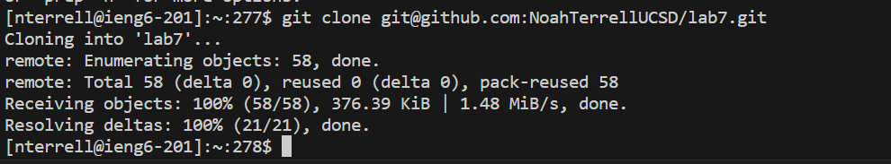

# Lab Report 3
## Vim Task
### Step 4:


```
Keys Pressed: <up> <Enter>
I logged into ieng6 on my account by pressing the up arrow key and then the Enter key because the command was already in my terminal history.
```

### Step 5:


```
Keys Pressed: git <Spacebar> clone <Spacebar> Ctrl+V <Enter>
I cloned the forked repository of lab7 inside the ieng6 using the ssh URL (git@github.com:NoahTerrellUCSD/lab7.git)
```


